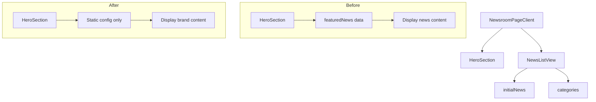

# Design Document: Newsroom Hero Section Optimization

## Overview

本设计文档描述了 Newsroom 页面 Hero Section 的优化方案。核心目标是将当前以头条新闻为中心的 Hero 转变为一个纯粹的品牌展示区域，保留视觉冲击力的同时简化组件结构。

### 设计目标

1. **简化组件** - 移除所有新闻相关的数据依赖和展示逻辑
2. **增强品牌** - 通过 tagline 和视觉层次传达 newsroom 的品牌定位
3. **引导浏览** - 添加滚动提示引导用户探索新闻内容
4. **保持一致** - 延续现有的视觉风格和动画语言

## Architecture

### 组件结构变更

```
Before:
NewsroomPageClient
├── HeroSection (接收 post 数据，展示头条新闻)
│   ├── Background Image (来自 post.mainImage)
│   ├── Category Badge
│   ├── Tags
│   ├── Date
│   ├── Title (post.title)
│   ├── Subtitle (post.subtitle)
│   └── Read More CTA
└── NewsListView

After:
NewsroomPageClient
├── HeroSection (纯展示组件，无数据依赖)
│   ├── Background Image (静态配置)
│   ├── Masthead Title ("Newsroom")
│   ├── Tagline (品牌描述)
│   └── Scroll Indicator
└── NewsListView
```

### 数据流变更



## Components and Interfaces

### HeroSection Component (Refactored)

```typescript
interface HeroSectionProps {
  locale: "en" | "zh";
}

// 静态配置
interface HeroConfig {
  backgroundImage: string;
  backgroundImageAlt: string;
  fallbackGradient: string;
}

const HERO_CONFIG: HeroConfig = {
  backgroundImage: "/images/newsroom.jpg",
  backgroundImageAlt: "isBIM Newsroom",
  fallbackGradient: "linear-gradient(135deg, #1a1a2e 0%, #16213e 50%, #0f3460 100%)"
};
```

### 组件 Props 变更

```typescript
// Before
function HeroSection({ post, readFeaturedLabel }: { 
  post: NewsPost; 
  readFeaturedLabel: string 
})

// After
function HeroSection({ locale }: { 
  locale: "en" | "zh" 
})
```

### NewsroomPageClient Props 变更

```typescript
// Before
interface NewsroomPageClientProps {
  initialNews: NewsPost[];
  categories: NewsCategory[];
  featuredNews: NewsPost | null;  // 将被移除
}

// After
interface NewsroomPageClientProps {
  initialNews: NewsPost[];
  categories: NewsCategory[];
  // featuredNews 不再需要
}
```

## Data Models

### 静态内容配置

```typescript
// 多语言 tagline 配置 (通过 paraglide messages)
// messages/en.json
{
  "newsroom_hero_tagline": "Latest insights, updates, and stories from isBIM"
}

// messages/zh.json
{
  "newsroom_hero_tagline": "来自 isBIM 的最新洞察、动态与故事"
}
```

### Hero 视觉配置

```typescript
const HERO_VISUAL_CONFIG = {
  // 高度配置
  minHeight: {
    mobile: "50vh",
    tablet: "60vh",
    desktop: "70vh"
  },
  
  // 背景图片
  backgroundImage: {
    src: "/images/newsroom.jpg",
    alt: "isBIM Newsroom Background",
    priority: true
  },
  
  // 渐变遮罩
  overlays: {
    bottom: "linear-gradient(to top, rgba(0,0,0,0.95), rgba(0,0,0,0.3) 50%, transparent)",
    top: "linear-gradient(to bottom, rgba(0,0,0,0.6), transparent)"
  }
};
```

## Correctness Properties

*A property is a characteristic or behavior that should hold true across all valid executions of a system-essentially, a formal statement about what the system should do. Properties serve as the bridge between human-readable specifications and machine-verifiable correctness guarantees.*

基于需求分析，大部分验收标准属于 UI 展示验证（example-based testing）而非通用属性测试。以下是可测试的关键验证点：

### Property 1: Hero Section 不包含新闻数据元素

*For any* rendered HeroSection component, the output SHALL NOT contain any elements with news-specific content (category badges, publication dates, article titles from news data, or "Read Story" links).

**Validates: Requirements 1.1, 1.2, 1.3, 1.4**

### Property 2: Hero Section 不可点击导航

*For any* rendered HeroSection component, the root element SHALL NOT be wrapped in a Link component or have onClick handlers that navigate to news articles.

**Validates: Requirements 1.5**

### Property 3: 核心视觉元素存在性

*For any* rendered HeroSection component, the output SHALL contain:
- An h1 element with "Newsroom" text
- A background image element
- A tagline/subtitle element
- A scroll indicator element

**Validates: Requirements 2.1, 3.1, 4.2**

### Property 4: 组件 Props 独立性

*For any* HeroSection component instantiation, the component SHALL NOT require or accept news post data as props.

**Validates: Requirements 6.2**

## Error Handling

### 背景图片加载失败

```typescript
// 图片加载失败时的 fallback 处理
const [imageError, setImageError] = useState(false);

<div className="hero-background">
  {!imageError ? (
    <Image
      src={HERO_CONFIG.backgroundImage}
      alt={HERO_CONFIG.backgroundImageAlt}
      fill
      priority
      onError={() => setImageError(true)}
      className="object-cover"
    />
  ) : (
    <div 
      className="absolute inset-0"
      style={{ background: HERO_CONFIG.fallbackGradient }}
    />
  )}
</div>
```

### 多语言 Fallback

```typescript
// 如果 tagline 翻译缺失，使用英文默认值
const tagline = m18n.newsroom_hero_tagline({}, { languageTag: locale }) 
  || "Latest insights, updates, and stories from isBIM";
```

## Testing Strategy

### 单元测试 (Unit Tests)

由于大部分需求是 UI 展示验证，采用 example-based 单元测试：

1. **组件渲染测试**
   - 验证 HeroSection 渲染包含必要元素
   - 验证不包含新闻相关元素
   - 验证 props 接口正确

2. **响应式测试**
   - 验证不同 viewport 下的样式应用

3. **错误处理测试**
   - 验证图片加载失败时显示 fallback

### 测试框架

- **Testing Library**: @testing-library/react
- **Test Runner**: Vitest 或 Jest

### 测试示例

```typescript
import { render, screen } from '@testing-library/react';
import { HeroSection } from './newsroom-page-client';

describe('HeroSection', () => {
  it('should render Newsroom title', () => {
    render(<HeroSection locale="en" />);
    expect(screen.getByRole('heading', { level: 1 })).toHaveTextContent('Newsroom');
  });

  it('should not contain news article elements', () => {
    render(<HeroSection locale="en" />);
    expect(screen.queryByText('Read Story')).not.toBeInTheDocument();
    expect(screen.queryByTestId('category-badge')).not.toBeInTheDocument();
  });

  it('should render tagline', () => {
    render(<HeroSection locale="en" />);
    expect(screen.getByText(/insights|updates|stories/i)).toBeInTheDocument();
  });

  it('should render scroll indicator', () => {
    render(<HeroSection locale="en" />);
    expect(screen.getByTestId('scroll-indicator')).toBeInTheDocument();
  });
});
```

### 视觉回归测试 (可选)

使用 Playwright 或 Chromatic 进行视觉回归测试，确保：
- Hero section 在不同设备上的视觉一致性
- 动画效果正常运行
- 响应式布局正确
